# Bridge Maintenance Agentic Clustering v0.5

## Overview

This project applies **self-improving (Agentic) clustering** to bridge maintenance data in Yamaguchi Prefecture, Japan, to automatically identify bridge groups with high maintenance priority.

### Key Improvements in v0.5

1. **Geospatial Features Added** (13-Feature System)
   - Under river flag (under_river)
   - Distance to coastline (distance_to_coast_km)

2. **Agentic Workflow Optimization**
   - GMM disabled (similar scores to K-Means)
   - DBSCAN exclusion rule (when clusters > 50)
   - HDBSCAN auto-triggering with parameter optimization

3. **Dimensionality Reduction Improvements**
   - t-SNE/UMAP operational fixes
   - Overlap threshold adjustment (0.10)
   - Automatic optimal method selection

---

## System Architecture

### Agentic Workflow Overview

```mermaid
flowchart TD
    Start([Start]) --> Load[Load Data<br/>4292 Bridges]
    Load --> Preprocess[Preprocessing<br/>Extract 13 Features]
    
    Preprocess --> Standardize[Standardize Features]
    
    Standardize --> KMeans[KMeans Initial Run<br/>k=2-28 Search]
    KMeans --> EvalKMeans{Quality Check<br/>Score 60+?}
    
    EvalKMeans -->|Yes| PCA1[Run PCA]
    EvalKMeans -->|No| AltClustering[Try Alternative Clustering]
    
    AltClustering --> DBSCAN[Run DBSCAN<br/>eps/min_samples Search]
    DBSCAN --> EvalDBSCAN{DBSCAN Evaluation}
    
    EvalDBSCAN --> CheckClusters{Clusters <= 50?}
    CheckClusters -->|No| TriggerHDBSCAN[Auto-trigger HDBSCAN<br/>Target 50 Clusters]
    CheckClusters -->|Yes| CompareAll[Compare Methods]
    TriggerHDBSCAN --> HDBSCAN[Run HDBSCAN<br/>min_cluster_size Search]
    
    HDBSCAN --> CompareAll
    CompareAll --> FilterDBSCAN{DBSCAN Clusters>50?}
    FilterDBSCAN -->|Yes| ExcludeDBSCAN[Exclude DBSCAN]
    FilterDBSCAN -->|No| SelectBest[Select Best Score]
    ExcludeDBSCAN --> SelectBest
    
    SelectBest --> BestMethod[Optimal Method<br/>HDBSCAN/KMeans]
    
    PCA1 --> BestMethod
    BestMethod --> PCA2[Run PCA<br/>n_components=2]
    PCA2 --> EvalPCA[Overlap Evaluation]
    
    EvalPCA --> CheckOverlap{Overlap<br/>Score <= 0.10?}
    CheckOverlap -->|Yes| UsePCA[Use PCA]
    CheckOverlap -->|No| AltDimRed[Try Alternative Dim Reduction]
    
    AltDimRed --> TSNE[Run t-SNE<br/>perplexity Search]
    TSNE --> UMAP[Run UMAP<br/>n_neighbors Search]
    UMAP --> CompareDimRed[Compare Dim Reduction]
    
    CompareDimRed --> SelectDimRed[Select Optimal Method<br/>Min Overlap]
    
    UsePCA --> Visualize[Visualization]
    SelectDimRed --> Visualize
    Visualize --> Output[Output Results<br/>CSV/PNG/TXT]
    Output --> End([End])
    
    classDef processClass fill:#e1f5ff,stroke:#01579b,stroke-width:2px
    classDef decisionClass fill:#fff9c4,stroke:#f57f17,stroke-width:2px
    classDef agenticClass fill:#f3e5f5,stroke:#4a148c,stroke-width:3px
    classDef outputClass fill:#e8f5e9,stroke:#1b5e20,stroke-width:2px
    
    class KMeans,DBSCAN,HDBSCAN,PCA2,TSNE,UMAP processClass
    class EvalKMeans,EvalDBSCAN,CheckClusters,FilterDBSCAN,CheckOverlap decisionClass
    class TriggerHDBSCAN,ExcludeDBSCAN,SelectBest,SelectDimRed agenticClass
    class Output outputClass
```



### Agentic Autonomous Decision Points

| # | Decision Point | Condition | Action |
|---|----------------|-----------|--------|
| 1 | Clustering Quality | Total Score < 60 | Try alternative methods (DBSCAN/HDBSCAN) |
| 2 | DBSCAN Cluster Count | Clusters > 50 | Auto-trigger HDBSCAN |
| 3 | DBSCAN Adoption | Clusters > 50 | Exclude from candidates |
| 4 | Dim Reduction Overlap | Score > 0.10 | Try alternatives (t-SNE/UMAP) |

---

## Feature System (13 Features)

### Basic Features (6 items)

| Feature | Description | Data Source |
|---------|-------------|-------------|
| `bridge_age` | Years since construction | Bridge Data |
| `condition_score` | Health score (0-3) | Bridge Data |
| `maintenance_priority` | Maintenance priority | Bridge Data |
| `future_burden_ratio` | Future burden ratio (%) | Fiscal Data |
| `aging_rate` | Aging rate (%) | Population Data |
| `fiscal_index` | Fiscal strength index | Fiscal Data |

### Extended Features (5 items)

| Feature | Description | Calculation Method |
|---------|-------------|--------------------|
| `structure_category` | Structure type category (0-4) | RC/PC/Steel/Box/Other |
| `bridge_area` | Bridge area (m²) | Length × Width |
| `emergency_route` | Emergency route flag (0/1) | Extracted from route name |
| `overpass` | Railway overpass flag (0/1) | Extracted from bridge name |
| `repair_year_normalized` | Normalized latest repair year | MinMax scaling |

### Geospatial Features (2 items) ✨ NEW

| Feature | Description | Data Source | Calculation Method |
|---------|-------------|-------------|-------------------|
| `under_river` | Under river flag (0/1) | National Land Numerical Information (River Data) | 50m buffer detection in UTM projection |
| `distance_to_coast_km` | Distance to coastline (km) | National Land Numerical Information (Coastline Data) | Geodesic distance calculation |

#### Geospatial Feature Implementation Details

**Coordinate Reference System (CRS)**:
- Input: WGS84 (EPSG:4326)
- Calculation: UTM Zone 53N (EPSG:32653)
- Auto-assign EPSG:4326 when Shapefile lacks CRS information

**River Detection**:
```python
# 50m buffer in UTM projection
bridge_point_proj = bridge_point.to_crs("EPSG:32653")
river_buffer = river_data_proj.buffer(50)  # 50m
has_river = bridge_point_proj.within(river_buffer.unary_union)
```

**Coastline Distance**:
```python
# Geodesic distance (calculated in WGS84)
distances = coastline.geometry.apply(
    lambda geom: bridge_point.distance(geom)
)
distance_m = distances.min() * 111000  # degrees to meters
distance_km = distance_m / 1000
```

**Execution Results**:
- Bridges under river: 2,447 (57.0%)
- Coastline distance range: 0.00-30.09 km
- Coastline distance average: 9.19 km

---

## Clustering Methods

### 1. KMeans (Initial Run)

- **Search Range**: k=2-28
- **Evaluation Metric**: Silhouette Score
- **Result**: k=27 optimal (score 0.1615)
- **Overall Score**: 43.95/100 → Try alternatives

### 2. DBSCAN (Density-Based)

- **Parameter Search**:
  - eps: 0.8, 1.0, 1.2, 1.4, 1.6
  - min_samples: 15, 20, 25, 30, 35

- **Execution Result**:
  - Clusters: 137
  - Total Score: 64.66/100 (Highest)
  - Silhouette Score: 0.5598

- **Issue**: 137 clusters exceed threshold of 50
- **Agentic Decision**: Excluded from candidates → Trigger HDBSCAN

### 3. HDBSCAN (Hierarchical DBSCAN) ✨ Agentic Trigger

- **Trigger Condition**: DBSCAN clusters > 50
- **Goal**: ~50 clusters

- **Parameter Search**:
  - min_cluster_size: 10, 15, 20, 30, 40
  - min_samples: 5, 8, 10
  - cluster_selection_method: 'eom' (Excess of Mass)

- **Scoring**:
  ```python
  cluster_penalty = abs(n_clusters - target_clusters) / target_clusters
  noise_penalty = n_noise / len(labels)
  adjusted_score = score * (1 - cluster_penalty * 0.5) * (1 - noise_penalty * 0.3)
  ```

- **Optimal Parameters**:
  - min_cluster_size=20
  - min_samples=8

- **Execution Result**:
  - Clusters: 52 ✅ (Close to target 50)
  - Noise: 1,565 points (36.5%)
  - Total Score: 49.04/100
  - Silhouette Score: 0.2478

- **Adoption Reason**: Highest score after DBSCAN exclusion

### Method Comparison (Final)

| Rank | Method | Total Score | Silhouette | DB Index | Clusters | Notes |
|------|--------|-------------|-----------|----------|----------|-------|
| 🥇 | **HDBSCAN** | 49.04 | 0.248 | 1.271 | 52 | ✅ Adopted |
| 🥈 | KMeans | 43.95 | 0.162 | 1.584 | 27 | - |
| ❌ | DBSCAN | 64.66 | 0.560 | 0.549 | 137 | Excluded (clusters > 50) |

---

## Dimensionality Reduction Methods

### 1. PCA (Initial Run)

- **Parameters**: n_components=2
- **Explained Variance**: 34.40%
- **Overlap Score**: 0.1879
- **Decision**: 0.1879 > 0.10 → Try alternatives

### 2. t-SNE (Alternative)

- **Parameter Search**: perplexity=30, 50
- **Optimal**: perplexity=30
- **KL divergence**: 0.6992
- **Overlap Score**: 0.4897
- **Evaluation**: Worse than PCA

**Implementation Note**:
```python
# scikit-learn version compatibility
try:
    tsne = TSNE(n_iter=1000, n_iter_without_progress=300)
except TypeError:
    tsne = TSNE(max_iter=1000, n_iter_without_progress=300)
```

### 3. UMAP (Alternative) ✨ Optimal

- **Parameter Search**: n_neighbors=15, 30
- **Optimal**: n_neighbors=15
- **Overlap Score**: 0.1877 ✅ (Best)
- **Adoption Reason**: Lowest overlap among 3 methods

### Dimensionality Reduction Comparison (Final)

| Rank | Method | Overlap Score | Cluster Center Distance | Notes |
|------|--------|--------------|------------------------|-------|
| 🥇 | **UMAP** | 0.1877 | 11.64 | ✅ Adopted |
| 🥈 | PCA | 0.1879 | 2.40 | Slightly worse |
| 🥉 | t-SNE | 0.4897 | 65.52 | High overlap |

**UMAP Advantages**:
- Balanced cluster separation
- Preserves both local and global structure
- Faster computation than t-SNE

---

## Installation

### Required Packages

```bash
pip install pandas numpy scikit-learn matplotlib seaborn
pip install openpyxl  # Excel file reading
pip install geopandas shapely pyproj  # Geospatial processing
pip install hdbscan  # Hierarchical density-based clustering
pip install umap-learn  # Dimensionality reduction
```

### Optional Packages

```bash
pip install japanize-matplotlib  # Japanese font support
```

### Verified Environment

- Python: 3.11.9
- scikit-learn: 1.7.2 (auto-upgraded from 1.4.0)
- geopandas: 1.1.1
- hdbscan: 0.8.40
- umap-learn: 0.5.9

---

## Usage

### Basic Execution

```bash
python run_all.py
```

Executes the following 3 steps sequentially:

1. **Data Preprocessing**: Extract 13 features
2. **Agentic Clustering**: Automatic method selection and execution
3. **Result Visualization**: Scatter plots, heatmaps, radar charts, etc.

### Output Files

```
output/
├── processed_bridge_data.csv      # Preprocessed data
├── cluster_results.csv            # Clustering results
├── cluster_summary.csv            # Cluster statistics
├── agentic_improvement_log.txt    # Improvement history log
├── cluster_pca_scatter.png        # UMAP scatter plot
├── cluster_heatmap.png            # Feature heatmap
├── cluster_radar.png              # Radar chart
├── cluster_distribution.png       # Cluster distribution
├── feature_boxplots.png           # Box plots
└── cluster_report.txt             # Analysis report
```

---

## Configuration (config.py)

### Main Parameters

```python
# Data paths
BRIDGE_DATA_PATH = 'data/BridgeData.xlsx'
FISCAL_DATA_PATH = 'data/FiscalData.xlsx'
POPULATION_DATA_PATH = 'data/PopulationData.xlsx'
RIVER_SHAPEFILE = 'data/RiverDataKokudo/.../W05-08_35-g_Stream.shp'
COASTLINE_SHAPEFILE = 'data/KaigansenDataKokudo/.../C23-06_35-g_Coastline.shp'

# Feature list (13 items)
FEATURE_COLUMNS = [
    'bridge_age', 'condition_score', 'maintenance_priority',
    'future_burden_ratio', 'aging_rate', 'fiscal_index',
    'structure_category', 'bridge_area', 'emergency_route',
    'overpass', 'repair_year_normalized',
    'under_river', 'distance_to_coast_km'  # Geospatial features
]

# Agentic workflow parameters
QUALITY_THRESHOLD = 60.0           # Clustering quality threshold
OVERLAP_THRESHOLD = 0.10           # Overlap threshold
DBSCAN_CLUSTER_THRESHOLD = 50      # DBSCAN cluster count threshold
```

---

## Lessons Learned

### Successful Agentic Decisions

1. **DBSCAN Exclusion Decision**
   - 137 clusters unsuitable for maintenance decision-making
   - Automatically triggered HDBSCAN
   - Result: Achieved practical granularity with 52 clusters

2. **HDBSCAN Auto-Triggering**
   - Parameter search achieved near-target 50 clusters
   - Optimized balance between noise ratio and cluster count

3. **Adaptive Dimensionality Reduction Selection**
   - PCA overlap exceeded threshold
   - Auto-tried t-SNE/UMAP
   - UMAP achieved best separation

### Technical Insights

1. **Geospatial Processing Best Practices**
   - Explicit CRS management is crucial
   - Accuracy of distance calculations in UTM projection
   - Auto-completion for Shapefiles without CRS

2. **Library Compatibility**
   - Handling API changes across scikit-learn versions
   - t-SNE `n_iter` vs `max_iter` issue
   - scikit-learn auto-upgrade by UMAP installation

3. **Parameter Tuning**
   - HDBSCAN's `min_cluster_size` works well when small (10-40)
   - Balance between noise penalty and cluster count penalty
   - Scoring considering deviation from target cluster count

---

## Project Structure

```
agentic-clustering/
├── data/                          # Data directory
│   ├── BridgeData.xlsx
│   ├── FiscalData.xlsx
│   ├── PopulationData.xlsx
│   ├── RiverDataKokudo/          # River data (Shapefile)
│   └── KaigansenDataKokudo/      # Coastline data (Shapefile)
├── output/                        # Output directory
├── config.py                      # Configuration file
├── data_preprocessing.py          # Data preprocessing
├── agentic_workflow.py           # Agentic workflow
├── alternative_methods.py        # Alternative methods
├── cluster_evaluator.py          # Evaluation metrics
├── visualize_results.py          # Visualization
├── run_all.py                    # Main script
└── README.md                     # This file
```

---

## References

### Clustering Methods

- **DBSCAN**: Ester, M., et al. (1996). "A density-based algorithm for discovering clusters in large spatial databases with noise"
- **HDBSCAN**: Campello, R. J., et al. (2013). "Density-based clustering based on hierarchical density estimates"

### Dimensionality Reduction

- **t-SNE**: van der Maaten, L., & Hinton, G. (2008). "Visualizing data using t-SNE"
- **UMAP**: McInnes, L., et al. (2018). "UMAP: Uniform Manifold Approximation and Projection"

### Geospatial Processing

- National Land Numerical Information: https://nlftp.mlit.go.jp/
- GeoPandas Documentation: https://geopandas.org/

---

## License

MIT License

---

## Changelog

### v0.5 (2025-11-24)

- ✅ Added geospatial features (under river, distance to coastline)
- ✅ Optimized HDBSCAN parameters (achieved 52 clusters)
- ✅ Implemented DBSCAN exclusion rule
- ✅ Disabled GMM for faster processing
- ✅ Fixed t-SNE/UMAP operational issues
- ✅ Adjusted overlap threshold (0.10)
- ✅ Added Agentic flow diagram (Mermaid)

### v0.4 (Previous)

- 11-feature system implementation
- Basic Agentic workflow implementation
- PCA dimensionality reduction

---

## Contact

For questions about this project, please use GitHub Issues.

---

**Developed for Bridge Maintenance Optimization** 🌉
