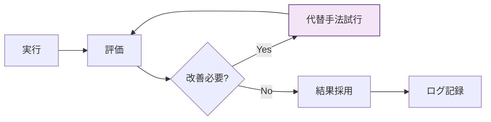

# 橋梁維持管理 Agentic Clustering v0.5

## 概要

本プロジェクトは、山口県の橋梁維持管理データに対して、**自己改善型（Agentic）クラスタリング**を適用し、補修優先度の高い橋梁群を自動的に特定するシステムです。

### v0.5の主要改善点

1. **地理空間特徴量の追加** (13特徴量システム)
   - 桁下河川（under_river）
   - 海岸線からの距離（distance_to_coast_km）

2. **Agenticワークフローの最適化**
   - GMM無効化（K-Meansと類似スコアのため）
   - DBSCAN除外ルール（50クラスタ超過時）
   - HDBSCAN自動起動とパラメータ最適化

3. **次元削減の改善**
   - t-SNE/UMAPの正常動作化
   - オーバーラップ閾値の調整（0.10）
   - 自動的な最適手法選択

---

## システムアーキテクチャ

### Agenticワークフローの全体像

```mermaid
flowchart TD
    Start([開始]) --> Load[データ読み込み<br/>4292橋梁]
    Load --> Preprocess[前処理<br/>13特徴量抽出]
    
    Preprocess --> Standardize[特徴量標準化]
    
    Standardize --> KMeans[KMeans初回実行<br/>k=2-28探索]
    KMeans --> EvalKMeans{品質評価<br/>総合スコア60以上?}
    
    EvalKMeans -->|Yes| PCA1[PCA実行]
    EvalKMeans -->|No| AltClustering[代替クラスタリング試行]
    
    AltClustering --> DBSCAN[DBSCAN実行<br/>eps/min_samples探索]
    DBSCAN --> EvalDBSCAN{DBSCAN評価}
    
    EvalDBSCAN --> CheckClusters{クラスタ数50以下?}
    CheckClusters -->|No| TriggerHDBSCAN[HDBSCAN自動起動<br/>目標50クラスタ]
    CheckClusters -->|Yes| CompareAll[手法比較]
    TriggerHDBSCAN --> HDBSCAN[HDBSCAN実行<br/>min_cluster_size探索]
    
    HDBSCAN --> CompareAll
    CompareAll --> FilterDBSCAN{DBSCANクラスタ数50超?}
    FilterDBSCAN -->|Yes| ExcludeDBSCAN[DBSCAN除外]
    FilterDBSCAN -->|No| SelectBest[最高スコア選択]
    ExcludeDBSCAN --> SelectBest
    
    SelectBest --> BestMethod[最適手法決定<br/>HDBSCAN/KMeans]
    
    PCA1 --> BestMethod
    BestMethod --> PCA2[PCA実行<br/>n_components=2]
    PCA2 --> EvalPCA[オーバーラップ評価]
    
    EvalPCA --> CheckOverlap{オーバーラップ<br/>スコア0.10以下?}
    CheckOverlap -->|Yes| UsePCA[PCA採用]
    CheckOverlap -->|No| AltDimRed[代替次元削減]
    
    AltDimRed --> TSNE[t-SNE実行<br/>perplexity探索]
    TSNE --> UMAP[UMAP実行<br/>n_neighbors探索]
    UMAP --> CompareDimRed[次元削減比較]
    
    CompareDimRed --> SelectDimRed[最適手法選択<br/>最小オーバーラップ]
    
    UsePCA --> Visualize[可視化]
    SelectDimRed --> Visualize
    Visualize --> Output[結果出力<br/>CSV/PNG/TXT]
    Output --> End([終了])
    
    classDef processClass fill:#e1f5ff,stroke:#01579b,stroke-width:2px
    classDef decisionClass fill:#fff9c4,stroke:#f57f17,stroke-width:2px
    classDef agenticClass fill:#f3e5f5,stroke:#4a148c,stroke-width:3px
    classDef outputClass fill:#e8f5e9,stroke:#1b5e20,stroke-width:2px
    
    class KMeans,DBSCAN,HDBSCAN,PCA2,TSNE,UMAP processClass
    class EvalKMeans,EvalDBSCAN,CheckClusters,FilterDBSCAN,CheckOverlap decisionClass
    class TriggerHDBSCAN,ExcludeDBSCAN,SelectBest,SelectDimRed agenticClass
    class Output outputClass
```



### Agenticの自律判断ポイント

| # | 判断ポイント | 条件 | アクション |
|---|------------|------|----------|
| 1 | クラスタリング品質 | 総合スコア < 60 | 代替手法（DBSCAN/HDBSCAN）試行 |
| 2 | DBSCANクラスタ数 | クラスタ数 > 50 | HDBSCAN自動起動 |
| 3 | DBSCAN採用可否 | クラスタ数 > 50 | 候補から除外 |
| 4 | 次元削減オーバーラップ | スコア > 0.10 | 代替手法（t-SNE/UMAP）試行 |

---

## 特徴量システム（13特徴量）

### 基本特徴量（6項目）

| 特徴量 | 説明 | データソース |
|--------|------|-------------|
| `bridge_age` | 架設年からの経過年数 | 橋梁データ |
| `condition_score` | 健全度スコア（0-3） | 橋梁データ |
| `maintenance_priority` | 維持管理優先度 | 橋梁データ |
| `future_burden_ratio` | 将来負担比率（%） | 財政力指数データ |
| `aging_rate` | 高齢化率（%） | 人口統計データ |
| `fiscal_index` | 財政力指数 | 財政力指数データ |

### 拡張特徴量（5項目）

| 特徴量 | 説明 | 計算方法 |
|--------|------|---------|
| `structure_category` | 構造形式カテゴリ（0-4） | RC系/PC系/鋼橋/ボックス/その他 |
| `bridge_area` | 橋面積（m²） | 橋長 × 幅員 |
| `emergency_route` | 緊急輸送道路フラグ（0/1） | 路線名からの抽出 |
| `overpass` | 跨線橋フラグ（0/1） | 橋梁名からの抽出 |
| `repair_year_normalized` | 最新補修年度の正規化値 | MinMaxスケーリング |

### 地理空間特徴量（2項目）✨ NEW

| 特徴量 | 説明 | データソース | 計算方法 |
|--------|------|------------|---------|
| `under_river` | 桁下河川フラグ（0/1） | 国土数値情報（河川データ） | UTM投影で50mバッファ判定 |
| `distance_to_coast_km` | 海岸線からの距離（km） | 国土数値情報（海岸線データ） | 測地線距離計算 |

#### 地理空間特徴量の実装詳細

**座標系の扱い**:
- 入力: WGS84 (EPSG:4326)
- 計算: UTM Zone 53N (EPSG:32653)
- Shapefileが座標系情報を持たない場合、自動的にEPSG:4326を設定

**河川判定**:
```python
# UTM投影で50mバッファ
bridge_point_proj = bridge_point.to_crs("EPSG:32653")
river_buffer = river_data_proj.buffer(50)  # 50m
has_river = bridge_point_proj.within(river_buffer.unary_union)
```

**海岸線距離**:
```python
# 測地線距離（WGS84座標系で計算）
distances = coastline.geometry.apply(
    lambda geom: bridge_point.distance(geom)
)
distance_m = distances.min() * 111000  # 度→メートル概算
distance_km = distance_m / 1000
```

**実行結果**:
- 桁下河川あり: 2,447件 (57.0%)
- 海岸線距離範囲: 0.00〜30.09km
- 海岸線距離平均: 9.19km

---

## クラスタリング手法

### 1. KMeans（初回実行）

- **探索範囲**: k=2〜28
- **評価指標**: シルエットスコア
- **結果**: k=27が最適（スコア0.1615）
- **総合評価**: 43.95/100 → 代替手法試行

### 2. DBSCAN（密度ベース）

- **パラメータ探索**:
  - eps: 0.8, 1.0, 1.2, 1.4, 1.6
  - min_samples: 15, 20, 25, 30, 35

- **実行結果**:
  - クラスタ数: 137
  - 総合スコア: 64.66/100（最高）
  - シルエットスコア: 0.5598

- **問題点**: クラスタ数が137で閾値50を超過
- **Agentic判断**: 採用候補から除外 → HDBSCAN起動

### 3. HDBSCAN（階層的DBSCAN）✨ Agenticトリガー

- **起動条件**: DBSCANクラスタ数 > 50
- **目標**: 約50クラスタ

- **パラメータ探索**:
  - min_cluster_size: 10, 15, 20, 30, 40
  - min_samples: 5, 8, 10
  - cluster_selection_method: 'eom' (Excess of Mass)

- **スコアリング**:
  ```python
  cluster_penalty = abs(n_clusters - target_clusters) / target_clusters
  noise_penalty = n_noise / len(labels)
  adjusted_score = score * (1 - cluster_penalty * 0.5) * (1 - noise_penalty * 0.3)
  ```

- **最適パラメータ**:
  - min_cluster_size=20
  - min_samples=8

- **実行結果**:
  - クラスタ数: 52 ✅（目標50に近い）
  - ノイズ: 1,565件 (36.5%)
  - 総合スコア: 49.04/100
  - シルエットスコア: 0.2478

- **採用理由**: DBSCANが除外されたため、最高スコアで採用

### 手法比較表（最終）

| 順位 | 手法 | 総合スコア | シルエット | DB指数 | クラスタ数 | 備考 |
|------|------|-----------|----------|--------|----------|------|
| 🥇 | **HDBSCAN** | 49.04 | 0.248 | 1.271 | 52 | ✅ 採用 |
| 🥈 | KMeans | 43.95 | 0.162 | 1.584 | 27 | - |
| ❌ | DBSCAN | 64.66 | 0.560 | 0.549 | 137 | クラスタ数超過で除外 |

---

## 次元削減手法

### 1. PCA（初回実行）

- **パラメータ**: n_components=2
- **説明分散**: 34.40%
- **オーバーラップスコア**: 0.1879
- **判定**: 0.1879 > 0.10 → 代替手法試行

### 2. t-SNE（代替手法）

- **パラメータ探索**: perplexity=30, 50
- **最適値**: perplexity=30
- **KL divergence**: 0.6992
- **オーバーラップスコア**: 0.4897
- **評価**: PCAより悪化

**実装上の注意点**:
```python
# scikit-learnバージョン互換性対応
try:
    tsne = TSNE(n_iter=1000, n_iter_without_progress=300)
except TypeError:
    tsne = TSNE(max_iter=1000, n_iter_without_progress=300)
```

### 3. UMAP（代替手法）✨ 最適

- **パラメータ探索**: n_neighbors=15, 30
- **最適値**: n_neighbors=15
- **オーバーラップスコア**: 0.1877 ✅（最良）
- **採用理由**: 3手法中で最小のオーバーラップ

### 次元削減比較表（最終）

| 順位 | 手法 | オーバーラップスコア | クラスタ中心間距離 | 備考 |
|------|------|-------------------|-----------------|------|
| 🥇 | **UMAP** | 0.1877 | 11.64 | ✅ 採用 |
| 🥈 | PCA | 0.1879 | 2.40 | わずかに劣る |
| 🥉 | t-SNE | 0.4897 | 65.52 | オーバーラップ大 |

**UMAPの優位性**:
- クラスタ間の適度な分離
- 局所構造と大域構造の両方を保持
- 計算速度がt-SNEより高速

---

## インストール

### 必須パッケージ

```bash
pip install pandas numpy scikit-learn matplotlib seaborn
pip install openpyxl  # Excelファイル読み込み
pip install geopandas shapely pyproj  # 地理空間処理
pip install hdbscan  # 階層的密度ベースクラスタリング
pip install umap-learn  # 次元削減
```

### オプションパッケージ

```bash
pip install japanize-matplotlib  # 日本語表示
```

### 動作確認済み環境

- Python: 3.11.9
- scikit-learn: 1.7.2（1.4.0から自動アップグレード）
- geopandas: 1.1.1
- hdbscan: 0.8.40
- umap-learn: 0.5.9

---

## 使用方法

### 基本的な実行

```bash
python run_all.py
```

実行すると以下の3ステップが順次実行されます:

1. **データ前処理**: 13特徴量の抽出
2. **Agenticクラスタリング**: 自動的な手法選択と実行
3. **結果の可視化**: 散布図、ヒートマップ、レーダーチャート等

### 出力ファイル

```
output/
├── processed_bridge_data.csv      # 前処理済みデータ
├── cluster_results.csv            # クラスタリング結果
├── cluster_summary.csv            # クラスタ統計
├── agentic_improvement_log.txt    # 改善履歴ログ
├── cluster_pca_scatter.png        # UMAP散布図
├── cluster_heatmap.png            # 特徴量ヒートマップ
├── cluster_radar.png              # レーダーチャート
├── cluster_distribution.png       # クラスタ分布
├── feature_boxplots.png           # 箱ひげ図
└── cluster_report.txt             # 分析レポート
```

---

## 設定ファイル（config.py）

### 主要パラメータ

```python
# データパス
BRIDGE_DATA_PATH = 'data/橋梁データ.xlsx'
FISCAL_DATA_PATH = 'data/財政力指数データ.xlsx'
POPULATION_DATA_PATH = 'data/人口統計データ.xlsx'
RIVER_SHAPEFILE = 'data/RiverDataKokudo/.../W05-08_35-g_Stream.shp'
COASTLINE_SHAPEFILE = 'data/KaigansenDataKokudo/.../C23-06_35-g_Coastline.shp'

# 特徴量リスト（13項目）
FEATURE_COLUMNS = [
    'bridge_age', 'condition_score', 'maintenance_priority',
    'future_burden_ratio', 'aging_rate', 'fiscal_index',
    'structure_category', 'bridge_area', 'emergency_route',
    'overpass', 'repair_year_normalized',
    'under_river', 'distance_to_coast_km'  # 地理空間特徴量
]

# Agenticワークフローパラメータ
QUALITY_THRESHOLD = 60.0           # クラスタリング品質閾値
OVERLAP_THRESHOLD = 0.10           # オーバーラップ閾値
DBSCAN_CLUSTER_THRESHOLD = 50      # DBSCANクラスタ数閾値
```

---

## 実行結果の教訓

### 成功したAgentic判断

1. **DBSCAN除外判断**
   - 137クラスタは補修意思決定に不適
   - 自動的にHDBSCANを起動
   - 結果: 52クラスタの実用的な粒度を実現

2. **HDBSCAN自動起動**
   - パラメータ探索により目標50クラスタに近い結果
   - ノイズ比率とクラスタ数のバランスを最適化

3. **次元削減の適応的選択**
   - PCAのオーバーラップが閾値超過
   - t-SNE/UMAPを自動試行
   - UMAP が最良の分離を実現

### 技術的な学び

1. **地理空間処理のベストプラクティス**
   - CRS（座標参照系）の明示的な管理が重要
   - UTM投影での距離計算の正確性
   - Shapefile の CRS 未設定時の自動補完

2. **ライブラリ互換性**
   - scikit-learn のバージョンによるAPI変更への対応
   - t-SNE の `n_iter` vs `max_iter` 問題
   - UMAP インストールによる scikit-learn 自動アップグレード

3. **パラメータチューニング**
   - HDBSCANの`min_cluster_size`は小さめ（10-40）が実用的
   - ノイズペナルティとクラスタ数ペナルティのバランス
   - 目標クラスタ数からの乖離度を考慮したスコアリング

### 今後の改善点

1. **GMM再評価**
   - 現在は無効化しているが、一部データでは有効な可能性
   - 条件付き有効化の検討

2. **クラスタ解釈性の向上**
   - 各クラスタの特性をより詳細に分析
   - 意思決定支援情報の充実

3. **地理空間特徴量の拡張**
   - 道路ネットワークとの関係
   - 災害リスク地域との重ね合わせ
   - 交通量データの統合

---

## Agenticワークフローの詳細

### 自己改善のメカニズム



### 改善履歴の例（実行ログ）

```
1. 【ラウンド1】初回クラスタリング（KMeans）
2. 【評価1】クラスタリング品質評価
3. 【ラウンド2】代替クラスタリング手法の試行
4. 【選択】最適クラスタリング手法の決定
5. 🎯 選択された手法: HDBSCAN
6. 【ラウンド1】初回次元削減（PCA）
7. 【評価2】次元削減のオーバーラップ評価
8. 【ラウンド2】代替次元削減手法の試行
9. 【選択】最適次元削減手法の決定
10. 🎯 次元削減手法: UMAP
```

---

## プロジェクト構成

```
agentic-clustering/
├── data/                          # データディレクトリ
│   ├── 橋梁データ.xlsx
│   ├── 財政力指数データ.xlsx
│   ├── 人口統計データ.xlsx
│   ├── RiverDataKokudo/          # 河川データ（Shapefile）
│   └── KaigansenDataKokudo/      # 海岸線データ（Shapefile）
├── output/                        # 出力ディレクトリ
├── config.py                      # 設定ファイル
├── data_preprocessing.py          # データ前処理
├── agentic_workflow.py           # Agenticワークフロー
├── alternative_methods.py        # 代替手法（DBSCAN/HDBSCAN/t-SNE/UMAP）
├── cluster_evaluator.py          # 評価指標
├── visualize_results.py          # 可視化
├── run_all.py                    # メインスクリプト
└── README_v05.md                 # このファイル
```

---

## 参考文献

### クラスタリング手法

- **DBSCAN**: Ester, M., et al. (1996). "A density-based algorithm for discovering clusters in large spatial databases with noise"
- **HDBSCAN**: Campello, R. J., et al. (2013). "Density-based clustering based on hierarchical density estimates"

### 次元削減手法

- **t-SNE**: van der Maaten, L., & Hinton, G. (2008). "Visualizing data using t-SNE"
- **UMAP**: McInnes, L., et al. (2018). "UMAP: Uniform Manifold Approximation and Projection for Dimension Reduction"

### 地理空間処理

- 国土数値情報ダウンロードサービス: https://nlftp.mlit.go.jp/
- GeoPandas Documentation: https://geopandas.org/

---

## ライセンス

MIT License

---

## 更新履歴

### v0.5 (2025-11-24)

- ✅ 地理空間特徴量の追加（桁下河川、海岸線距離）
- ✅ HDBSCANパラメータの最適化（52クラスタ実現）
- ✅ DBSCAN除外ルールの実装
- ✅ GMM無効化による処理高速化
- ✅ t-SNE/UMAPの正常動作化
- ✅ オーバーラップ閾値の調整（0.10）
- ✅ Agenticフロー図の追加（Mermaid）

### v0.4 (以前)

- 11特徴量システムの実装
- Agenticワークフローの基本実装
- PCA次元削減の実装

---

## お問い合わせ

本プロジェクトに関するご質問は、GitHubのIssuesまでお願いします。
