# 橋梁維持管理 Agentic Clustering v0.6

## 概要

山口県の橋梁維持管理データに対して、**自己改善型（Agentic）クラスタリング**を適用し、補修優先度の高い橋梁グループを自動的に識別するシステムです。

### v0.6の主要改善点

1. **クラスタ数の最適化**
   - MAX_CLUSTERS = 19（山口県の自治体総数）に設定
   - K-Means/GMMは2～19クラスタの範囲で探索
   - DBSCAN閾値を19に設定
   - HDBSCAN目標クラスタ数を28（19 × 1.5）に調整

2. **次元削減の強化**
   - t-SNEのperplexity探索範囲を拡張 [10, 30, 50]
   - 最適手法に応じた可視化（PCA/t-SNE/UMAP）

3. **可視化の改善**
   - クラスタ分布を横棒グラフ化（視認性向上）
   - 13特徴量すべてを表示（箱ひげ図: 5行3列）
   - 散布図タイトル・軸ラベルが次元削減手法に対応

---

## システムアーキテクチャ

### v0.6 Agenticワークフロー

```mermaid
flowchart TD
    Start([開始]) --> Load[データ読み込み<br/>4292橋梁]
    Load --> Preprocess[前処理<br/>13特徴量抽出]
    
    Preprocess --> Standardize[特徴量標準化]
    
    Standardize --> KMeans[KMeans初期実行<br/>k=2-19探索]
    KMeans --> EvalKMeans{品質チェック<br/>スコア60以上?}
    
    EvalKMeans -->|Yes| PCA1[PCA実行]
    EvalKMeans -->|No| AltClustering[代替クラスタリング]
    
    AltClustering --> DBSCAN[DBSCAN実行<br/>eps/min_samples探索]
    DBSCAN --> EvalDBSCAN{DBSCAN評価}
    
    EvalDBSCAN --> CheckClusters{クラスタ数<br/>19以下?}
    CheckClusters -->|No| TriggerHDBSCAN[HDBSCAN自動起動<br/>目標28クラスタ]
    CheckClusters -->|Yes| CompareAll[手法比較]
    TriggerHDBSCAN --> HDBSCAN[HDBSCAN実行<br/>min_cluster_size探索]
    
    HDBSCAN --> CompareAll
    CompareAll --> FilterDBSCAN{DBSCAN<br/>クラスタ>19?}
    FilterDBSCAN -->|Yes| ExcludeDBSCAN[DBSCAN除外]
    FilterDBSCAN -->|No| SelectBest[最高スコア選択]
    ExcludeDBSCAN --> SelectBest
    
    SelectBest --> BestMethod[最適手法決定<br/>HDBSCAN/KMeans]
    
    PCA1 --> BestMethod
    BestMethod --> PCA2[PCA実行<br/>n_components=2]
    PCA2 --> EvalPCA[オーバーラップ評価]
    
    EvalPCA --> CheckOverlap{オーバーラップ<br/>0.10以下?}
    CheckOverlap -->|Yes| UsePCA[PCA採用]
    CheckOverlap -->|No| AltDimRed[代替次元削減]
    
    AltDimRed --> TSNE[t-SNE実行<br/>perplexity=10,30,50]
    TSNE --> UMAP[UMAP実行<br/>n_neighbors探索]
    UMAP --> CompareDimRed[次元削減比較]
    
    CompareDimRed --> SelectDimRed[最適手法選択<br/>最小オーバーラップ]
    
    UsePCA --> Visualize[可視化生成]
    SelectDimRed --> Visualize
    Visualize --> Output[結果出力<br/>CSV/PNG/TXT]
    Output --> End([完了])
    
    classDef processClass fill:#e1f5ff,stroke:#01579b,stroke-width:2px
    classDef decisionClass fill:#fff9c4,stroke:#f57f17,stroke-width:2px
    classDef agenticClass fill:#f3e5f5,stroke:#4a148c,stroke-width:3px
    classDef outputClass fill:#e8f5e9,stroke:#1b5e20,stroke-width:2px
    
    class KMeans,DBSCAN,HDBSCAN,PCA2,TSNE,UMAP processClass
    class EvalKMeans,EvalDBSCAN,CheckClusters,FilterDBSCAN,CheckOverlap decisionClass
    class TriggerHDBSCAN,ExcludeDBSCAN,SelectBest,SelectDimRed agenticClass
    class Output outputClass
```



### Agentic自律判断ポイント

| # | 判断ポイント | 条件 | アクション |
|---|-------------|------|-----------|
| 1 | クラスタリング品質 | 総合スコア < 60 | 代替手法試行（DBSCAN/HDBSCAN） |
| 2 | DBSCANクラスタ数 | クラスタ数 > 19 | HDBSCAN自動起動（目標28） |
| 3 | DBSCAN採用判定 | クラスタ数 > 19 | 候補から除外 |
| 4 | 次元削減オーバーラップ | スコア > 0.10 | 代替手法試行（t-SNE/UMAP） |

---

## 特徴量システム（13特徴量）

### 基本特徴量（6項目）

| 特徴量 | 説明 | データソース |
|--------|------|--------------|
| `bridge_age` | 橋齢（年） | 橋梁データ |
| `condition_score` | 健全度スコア（0-3） | 橋梁データ |
| `maintenance_priority` | 補修優先度 | 橋梁データ |
| `future_burden_ratio` | 将来負担比率（%） | 財政データ |
| `aging_rate` | 高齢化率（%） | 人口データ |
| `fiscal_index` | 財政力指数 | 財政データ |

### 拡張特徴量（5項目）

| 特徴量 | 説明 | 算出方法 |
|--------|------|----------|
| `structure_category` | 構造形式カテゴリー（0-4） | RC/PC/鋼橋/ボックス/その他 |
| `bridge_area` | 橋面積（m²） | 橋長×幅員 |
| `emergency_route` | 緊急輸送道路フラグ（0/1） | 路線名から抽出 |
| `overpass` | 跨線橋フラグ（0/1） | 橋梁名から抽出 |
| `repair_year_normalized` | 最新補修年度正規化値 | MinMaxスケーリング |

### 地理空間特徴量（2項目）✨ NEW

| 特徴量 | 説明 | データソース | 算出方法 |
|--------|------|--------------|----------|
| `under_river` | 桁下河川フラグ（0/1） | 国土数値情報（河川データ） | UTM投影50mバッファ検出 |
| `distance_to_coast_km` | 海岸線距離（km） | 国土数値情報（海岸線データ） | 測地線距離計算 |

#### 地理空間特徴量実装詳細

**座標参照系（CRS）**:
- 入力: WGS84 (EPSG:4326)
- 計算: UTM Zone 53N (EPSG:32653)
- Shapefile未設定時は自動的にEPSG:4326を割り当て

**河川検出**:
```python
# UTM投影で50mバッファ
bridge_point_proj = bridge_point.to_crs("EPSG:32653")
river_buffer = river_data_proj.buffer(50)  # 50m
has_river = bridge_point_proj.within(river_buffer.unary_union)
```

**海岸線距離**:
```python
# 測地線距離（WGS84で計算）
distances = coastline.geometry.apply(
    lambda geom: bridge_point.distance(geom)
)
distance_m = distances.min() * 111000  # 度→メートル変換
distance_km = distance_m / 1000
```

**v0.6実行結果**:
- 桁下河川あり: 2,447件（57.0%）
- 海岸線距離範囲: 0.00～30.09km
- 海岸線距離平均: 9.19km

---

## クラスタリング手法

### 1. KMeans（初期実行）

- **探索範囲**: k=2～19（自治体総数まで）
- **評価指標**: シルエットスコア
- **v0.6結果**: k=15が最適（スコア 0.1615）
- **総合スコア**: 43.95/100 → 代替手法を試行

### 2. DBSCAN（密度ベース）

- **パラメータ探索**:
  - eps: 0.8, 1.0, 1.2, 1.4, 1.6
  - min_samples: 15, 20, 25, 30, 35

- **v0.6実行結果**:
  - クラスタ数: 137
  - 総合スコア: 64.66/100（最高）
  - シルエットスコア: 0.5598

- **問題点**: 137クラスタは閾値19を大幅超過
- **Agentic判定**: 候補から除外 → HDBSCAN起動

### 3. HDBSCAN（階層的密度ベース）✨ Agentic起動

- **起動条件**: DBSCANクラスタ数 > 19
- **目標**: 28クラスタ（19 × 1.5）

- **パラメータ探索**:
  - min_cluster_size: 10, 15, 20, 30, 40
  - min_samples: 5, 8, 10
  - cluster_selection_method: 'eom'（Excess of Mass）

- **スコアリング**:
  ```python
  cluster_penalty = abs(n_clusters - 28) / 28
  noise_penalty = n_noise / len(labels)
  adjusted_score = score * (1 - cluster_penalty * 0.5) * (1 - noise_penalty * 0.3)
  ```

- **最適パラメータ**:
  - min_cluster_size=30
  - min_samples=8

- **v0.6実行結果**:
  - クラスタ数: 28 ✅（目標達成！）
  - ノイズ: 1,565点（36.5%）
  - 総合スコア: 48.51/100
  - シルエットスコア: 0.2260

- **採用理由**: DBSCAN除外後の最高スコア、目標クラスタ数に到達

### 手法比較（v0.6最終結果）

| ランク | 手法 | 総合スコア | シルエット | DB指数 | クラスタ数 | 備考 |
|--------|------|-----------|-----------|--------|-----------|------|
| 🥇 | **HDBSCAN** | 48.51 | 0.226 | 1.342 | 28 | ✅ 採用（目標達成） |
| 🥈 | KMeans | 43.95 | 0.162 | 1.584 | 15 | - |
| ❌ | DBSCAN | 64.66 | 0.560 | 0.549 | 137 | 除外（クラスタ数>19） |

---

## 次元削減手法

### 1. PCA（初期実行）

- **パラメータ**: n_components=2
- **寄与率**: 34.40%
- **オーバーラップスコア**: 0.1879
- **判定**: 0.1879 > 0.10 → 代替手法を試行

### 2. t-SNE（代替手法）✨ v0.6強化

- **パラメータ探索**: perplexity=10, 30, 50（v0.6で10を追加）
- **最適**: perplexity=30
- **KLダイバージェンス**: 0.6992
- **オーバーラップスコア**: 0.4897
- **評価**: PCAより悪化

**実装詳細**:
```python
# scikit-learnバージョン互換性対応
try:
    tsne = TSNE(n_iter=1000, n_iter_without_progress=300)
except TypeError:
    tsne = TSNE(max_iter=1000, n_iter_without_progress=300)
```

### 3. UMAP（代替手法）✨ 最適

- **パラメータ探索**: n_neighbors=15, 30
- **最適**: n_neighbors=15
- **オーバーラップスコア**: 0.1877 ✅（最良）
- **採用理由**: 3手法中最小のオーバーラップ

### 次元削減比較（v0.6最終結果）

| ランク | 手法 | オーバーラップスコア | クラスタ中心距離 | 備考 |
|--------|------|-------------------|-----------------|------|
| 🥇 | **UMAP** | 0.1877 | 11.64 | ✅ 採用 |
| 🥈 | PCA | 0.1879 | 2.40 | わずかに劣る |
| 🥉 | t-SNE | 0.4897 | 65.52 | オーバーラップ大 |

**UMAPの利点**:
- バランスの取れたクラスタ分離
- 局所・大域構造の両方を保存
- t-SNEより高速な計算

---

## インストール

### 必須パッケージ

```bash
pip install pandas numpy scikit-learn matplotlib seaborn
pip install openpyxl  # Excel読み込み
pip install geopandas shapely pyproj  # 地理空間処理
pip install hdbscan  # 階層的密度ベースクラスタリング
pip install umap-learn  # 次元削減
```

### オプション

```bash
pip install japanize-matplotlib  # 日本語フォント対応
```

### 検証済み環境

- Python: 3.11.9
- scikit-learn: 1.7.2（UMAP導入で自動アップグレード）
- geopandas: 1.1.1
- hdbscan: 0.8.40
- umap-learn: 0.5.9

---

## 使用方法

### 基本実行

```bash
python run_all.py
```

以下の3ステップを順次実行:

1. **データ前処理**: 13特徴量抽出
2. **Agenticクラスタリング**: 自動手法選択・実行
3. **結果可視化**: 散布図、ヒートマップ、レーダーチャート等

### 出力ファイル

```
output/
├── processed_bridge_data.csv      # 前処理済みデータ
├── cluster_results.csv            # クラスタリング結果
├── cluster_summary.csv            # クラスタ統計
├── agentic_improvement_log.txt    # 改善履歴ログ
├── cluster_pca_scatter.png        # 散布図（UMAP/PCA/t-SNE）
├── cluster_heatmap.png            # 特徴量ヒートマップ
├── cluster_radar.png              # レーダーチャート
├── cluster_distribution.png       # クラスタ分布（横棒グラフ）
├── feature_boxplots.png           # 箱ひげ図（13特徴量）
└── cluster_report.txt             # 分析レポート
```

---

## 出力結果の詳細

### 📊 cluster_pca_scatter.png - 散布図

**v0.6の改善点**: 最適次元削減手法に応じた表示

- **UMAP採用時** (v0.6実行例):
  - タイトル: 「橋梁維持管理クラスタリング結果（UMAP 2次元可視化）」
  - X軸: UMAP 成分 1
  - Y軸: UMAP 成分 2
  - 28クラスタの分布を色分け表示

- **PCA採用時**:
  - X軸: 第1主成分 (寄与率%)
  - Y軸: 第2主成分 (寄与率%)

- **t-SNE採用時**:
  - X軸: t-SNE 成分 1
  - Y軸: t-SNE 成分 2

**特徴**:
- 各クラスタを異なる色で表示
- ノイズクラスタ（-1）も含む
- クラスタ間の分離度を視覚的に確認可能

### 🔥 cluster_heatmap.png - 特徴量ヒートマップ

**内容**: 28クラスタ × 13特徴量の標準化スコア

**色の意味**:
- 🔴 赤: 高い値（リスク高）
- 🟡 黄: 中程度
- 🟢 緑: 低い値（リスク低）

**v0.6実行例**:
- クラスタ9: 健全度3.0、補修優先度170（最高リスク）
- クラスタ1: 橋齢42.4年、財政負担118.1%（財政的リスク）
- クラスタ22: 橋梁海岸距離16.2km（塩害リスク）

### 📡 cluster_radar.png - レーダーチャート

**v0.6の改善点**: 13特徴量すべてを軸に表示

**表示内容**:
- 13軸のレーダーチャート
- 各クラスタの特性を0-1スケールで正規化
- 複数クラスタの重ね合わせ表示
- 透明度0.25で重なりを視認可能

**活用方法**:
- クラスタ間の特性比較
- 極端な値を持つクラスタの特定
- バランスの取れたクラスタの識別

### 📊 cluster_distribution.png - クラスタ分布

**v0.6の改善点**: 縦棒→横棒グラフに変更

**表示形式**:
- 横棒グラフ（視認性向上）
- 各バーに橋梁数と割合を表示
- 高さはクラスタ数に応じて自動調整
- カラーパレット: Set2

**v0.6実行例**（28クラスタ）:
```
クラスタ-1（ノイズ）: 1565件 (36.5%)  [最大]
クラスタ0: 43件 (1.0%)
クラスタ1: 39件 (0.9%)
...
クラスタ27: 22件 (0.5%)
```

### 📦 feature_boxplots.png - 箱ひげ図

**v0.6の改善点**: 13特徴量すべてを表示（5行3列レイアウト）

**表示内容**:
- 各特徴量のクラスタ別分布
- 中央値、四分位範囲、外れ値を表示
- クラスタ間の特徴量差異を視覚化

**主要な知見例**:
- `bridge_age`: クラスタ11は平均61.3歳（最高齢）
- `condition_score`: クラスタ9は平均3.0（最悪健全度）
- `distance_to_coast_km`: クラスタ18は平均16.5km（塩害リスク）

### 📝 cluster_report.txt - 分析レポート

**内容**:
1. **クラスタ分布**: 各クラスタの件数と割合
2. **クラスタごとの特徴量平均**: 13特徴量の平均値
3. **クラスタ解釈**: 各クラスタのリスク評価

**リスク評価基準**:
- 🔴 高リスク: 3つ以上の高リスク要因
- 🟡 中リスク: 2つの高リスク要因
- 🟢 低リスク: 0-1つの高リスク要因

**高リスク要因**:
- 橋齢 > 50年
- 健全度スコア ≥ 2.5
- 補修優先度 > 100
- 財政負担比率 > 60%

**v0.6実行例（抜粋）**:
```
■ クラスタ 9
  橋齢: 56.7年
  健全度: 3.0
  補修優先度: 170.2
  【評価】🔴 高リスク
  【要因】高齢橋梁, 低健全度, 高補修優先度
```

---

## 設定（config.py）

### 主要パラメータ（v0.6）

```python
# データパス
BRIDGE_DATA_PATH = 'data/BridgeData.xlsx'
FISCAL_DATA_PATH = 'data/FiscalData.xlsx'
POPULATION_DATA_PATH = 'data/PopulationData.xlsx'
RIVER_SHAPEFILE = 'data/RiverDataKokudo/.../W05-08_35-g_Stream.shp'
COASTLINE_SHAPEFILE = 'data/KaigansenDataKokudo/.../C23-06_35-g_Coastline.shp'

# クラスタリングパラメータ
MAX_MUNICIPALITIES = 19  # 山口県の自治体総数
MIN_CLUSTERS = 2
MAX_CLUSTERS = 19  # K-Means/GMMの最大クラスタ数
RANDOM_STATE = 42

# Agenticワークフローパラメータ
QUALITY_THRESHOLD = 60.0           # クラスタリング品質閾値
OVERLAP_THRESHOLD = 0.10           # オーバーラップ閾値
DBSCAN_CLUSTER_THRESHOLD = 19      # DBSCANクラスタ数閾値
HDBSCAN_TARGET_CLUSTERS = 28       # HDBSCAN目標（19 × 1.5）

# 特徴量リスト（13項目）
FEATURE_COLUMNS = [
    'bridge_age', 'condition_score', 'maintenance_priority',
    'future_burden_ratio', 'aging_rate', 'fiscal_index',
    'structure_category', 'bridge_area', 'emergency_route',
    'overpass', 'repair_year_normalized',
    'under_river', 'distance_to_coast_km'  # 地理空間特徴量
]
```

---

## v0.6実行結果サマリー

### Agenticクラスタリング

| 項目 | 結果 |
|------|------|
| **採用クラスタリング手法** | HDBSCAN |
| **クラスタ数** | 28（目標28達成✅） |
| **ノイズ点** | 1,565点（36.5%） |
| **シルエットスコア** | 0.226 |
| **Davies-Bouldin指数** | 1.342 |
| **Calinski-Harabasz指数** | 207.62 |
| **総合スコア** | 48.51/100 |

### Agentic次元削減

| 項目 | 結果 |
|------|------|
| **採用次元削減手法** | UMAP |
| **最適パラメータ** | n_neighbors=15 |
| **オーバーラップスコア** | 0.1877 |
| **クラスタ中心距離** | 11.64 |

### 改善履歴（10ステップ）

1. ✅ 【ラウンド1】初回クラスタリング（KMeans）
2. ✅ 【評価1】クラスタリング品質評価
3. ✅ 【ラウンド2】代替クラスタリング手法の試行
4. ✅ 【選択】最適クラスタリング手法の決定
5. 🎯 **選択された手法: HDBSCAN**
6. ✅ 【ラウンド1】初回次元削減（PCA）
7. ✅ 【評価2】次元削減のオーバーラップ評価
8. ✅ 【ラウンド2】代替次元削減手法の試行
9. ✅ 【選択】最適次元削減手法の決定
10. 🎯 **次元削減手法: UMAP**

---

## 教訓と知見

### v0.6で得られた成果

1. **最適クラスタ数の達成**
   - HDBSCAN目標28クラスタを正確に達成
   - 自治体総数×1.5という実用的な粒度を実現
   - 意思決定に適した管理可能なクラスタ数

2. **Agentic判断の成功例**
   - DBSCAN（137クラスタ）を自動除外
   - HDBSCAN自動起動で目標達成
   - UMAP選択で最適な次元削減実現

3. **可視化の改善効果**
   - 横棒グラフで多クラスタも視認可能
   - 13特徴量すべてを表示（情報量向上）
   - 次元削減手法に応じた適切なラベル表示

### 技術的知見

1. **地理空間処理のベストプラクティス**
   - 明示的なCRS管理が重要
   - UTM投影での距離計算の精度
   - Shapefile未設定時の自動補完

2. **ライブラリ互換性**
   - scikit-learn APIの変更への対応
   - t-SNEの`n_iter` vs `max_iter`問題
   - UMAPインストールによるscikit-learn自動アップグレード

3. **パラメータチューニング**
   - HDBSCANの`min_cluster_size`は小さめ（10-40）が有効
   - ノイズペナルティとクラスタ数ペナルティのバランス
   - 目標クラスタ数からの乖離を考慮したスコアリング

4. **可視化の工夫**
   - 横棒グラフの高さを動的調整（`max(6, n_clusters * 0.3)`）
   - 13特徴量に対応した5行3列レイアウト
   - 次元削減手法名を動的に反映

---

## プロジェクト構造

```
agentic-clustering/
├── data/                          # データディレクトリ
│   ├── BridgeData.xlsx
│   ├── FiscalData.xlsx
│   ├── PopulationData.xlsx
│   ├── RiverDataKokudo/          # 河川データ（Shapefile）
│   └── KaigansenDataKokudo/      # 海岸線データ（Shapefile）
├── output/                        # 出力ディレクトリ
│   ├── cluster_pca_scatter.png   # UMAP散布図
│   ├── cluster_heatmap.png       # 特徴量ヒートマップ
│   ├── cluster_radar.png         # レーダーチャート（13軸）
│   ├── cluster_distribution.png  # クラスタ分布（横棒）
│   ├── feature_boxplots.png      # 箱ひげ図（5行3列）
│   └── cluster_report.txt        # 分析レポート
├── config.py                      # 設定ファイル
├── data_preprocessing.py          # データ前処理
├── agentic_workflow.py           # Agenticワークフロー
├── alternative_methods.py        # 代替手法
├── cluster_evaluator.py          # 評価指標
├── visualization.py              # 可視化
├── run_all.py                    # メインスクリプト
└── README_v06.md                 # このファイル
```

---

## 参考文献

### クラスタリング手法

- **DBSCAN**: Ester, M., et al. (1996). "A density-based algorithm for discovering clusters in large spatial databases with noise"
- **HDBSCAN**: Campello, R. J., et al. (2013). "Density-based clustering based on hierarchical density estimates"

### 次元削減

- **t-SNE**: van der Maaten, L., & Hinton, G. (2008). "Visualizing data using t-SNE"
- **UMAP**: McInnes, L., et al. (2018). "UMAP: Uniform Manifold Approximation and Projection"

### 地理空間処理

- 国土数値情報: https://nlftp.mlit.go.jp/
- GeoPandas Documentation: https://geopandas.org/

---

## ライセンス

MIT License

---

## 変更履歴

### v0.6 (2025-11-25)

- ✅ **クラスタ数最適化**: MAX_CLUSTERS=19、HDBSCAN目標=28
- ✅ **t-SNE強化**: perplexity=10を追加（[10, 30, 50]）
- ✅ **可視化改善**: 横棒グラフ、13特徴量表示、次元削減手法対応
- ✅ **HDBSCAN成功**: 目標28クラスタを正確に達成
- ✅ **UMAP採用**: 最小オーバーラップ0.1877

### v0.5 (2024-11-24)

- ✅ 地理空間特徴量追加（under_river, distance_to_coast_km）
- ✅ HDBSCANパラメータ最適化（52クラスタ達成）
- ✅ DBSCAN除外ルール実装
- ✅ GMM無効化（パフォーマンス向上）
- ✅ t-SNE/UMAP動作修正
- ✅ オーバーラップ閾値調整（0.10）
- ✅ Agenticフロー図追加（Mermaid）

### v0.4 (Previous)

- 11特徴量システム実装
- 基本Agenticワークフロー実装
- PCA次元削減

---

## お問い合わせ

本プロジェクトに関するご質問は、GitHub Issuesをご利用ください。

---

**橋梁維持管理の最適化のために開発** 🌉
