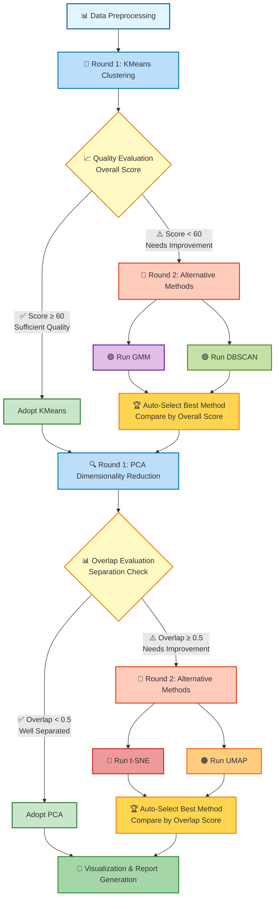

# 橋梁維持管理 Agentic Clustering v0.2 🤖

**山口県を対象にした「橋梁維持管理 Agenticクラスタリング」**

自己評価と改善を繰り返す賢いクラスタリングシステム。クラスタリング結果を自動評価し、品質が不十分な場合は代替手法（GMM、DBSCAN）を試行。次元削減もオーバーラップを検出して、t-SNEやUMAPに自動切り替えします。

---

## 🆕 v0.2の新機能（Agentic）

### 🤖 自己評価と自動改善
1. **クラスタリング品質の自動評価**
   - シルエットスコア
   - Davies-Bouldin指数
   - Calinski-Harabasz指数
   - クラスタバランス
   - 総合スコア（0-100点）

2. **代替クラスタリング手法の自動試行**
   - 初回: KMeans（シルエットスコアで最適クラスタ数決定）
   - 品質不足時: GMM、DBSCANを追加実行
   - 最適手法を自動選択（総合スコアで比較）

3. **次元削減のオーバーラップ検出**
   - クラスタ中心間の距離を計算
   - クラスタ内分散を評価
   - オーバーラップスコアで判定

4. **代替次元削減手法の自動試行**
   - 初回: PCA（計算速度重視）
   - オーバーラップ大: t-SNE、UMAPを追加実行
   - 最適手法を自動選択（オーバーラップスコアで比較）

---

## 🎯 プロジェクト概要

### 目的
- 山口県内の橋梁を維持管理困難度でクラスタリング
- 補修優先度の高い群を定量的に抽出
- 財政力指数や人口動態を組み合わせた合理的な補修計画の支援
- **NEW**: 自動的に最適な分析手法を選択

### ワークフロー



---

## 📂 プロジェクト構造

```
agentic-clustering/
│
├── data/                                    # データフォルダ
│   ├── YamaguchiPrefBridgeListOpen251122_154891.xlsx
│   ├── 全市町村の主要財政指標_000917808.xlsx
│   └── 市区町村別年齢階級別人口_2304ssnen.xlsx
│
├── output/                                  # 出力フォルダ（自動生成）
│   ├── processed_bridge_data.csv            # 前処理済みデータ
│   ├── cluster_results.csv                  # クラスタリング結果
│   ├── cluster_summary.csv                  # クラスタサマリー
│   ├── agentic_improvement_log.txt          # 🆕 Agentic改善ログ
│   ├── cluster_pca_scatter.png              # 散布図（最適手法）
│   ├── cluster_heatmap.png                  # ヒートマップ
│   ├── cluster_radar.png                    # レーダーチャート
│   ├── cluster_distribution.png             # 分布図
│   ├── feature_boxplots.png                 # 箱ひげ図
│   └── cluster_report.txt                   # 分析レポート
│
├── config.py                                # 設定ファイル
├── data_preprocessing.py                    # データ前処理
├── clustering.py                            # 標準クラスタリング（v0.1互換）
├── cluster_evaluator.py                     # 🆕 評価モジュール
├── alternative_methods.py                   # 🆕 代替手法モジュール
├── agentic_workflow.py                      # 🆕 Agenticワークフロー
├── visualization.py                         # 可視化
├── run_all.py                               # 🆕 統合実行（Agentic版）
├── requirements.txt                         # 依存パッケージ
└── README.md                                # このファイル
```

---

## 🚀 セットアップ手順

### 1. 必要なパッケージのインストール

```powershell
pip install -r requirements.txt
```

**主な依存パッケージ:**
- pandas >= 2.0.0
- numpy >= 1.24.0
- scikit-learn >= 1.3.0
- matplotlib >= 3.7.0
- seaborn >= 0.12.0
- openpyxl >= 3.1.0
- japanize-matplotlib >= 1.1.3
- **umap-learn >= 0.5.0** 🆕
- **scipy >= 1.10.0** 🆕

### 2. データの配置

`data/` フォルダに以下のファイルを配置してください:
- 橋梁管理一覧表（Excel形式）
- 財政力指数データ（Excel形式）
- 人口統計データ（Excel形式）

---

## 💻 使い方

### 統合実行（推奨）

```powershell
python run_all.py
```

全処理が自動で実行されます:
1. データ前処理
2. Agenticクラスタリング（自動評価・改善）
3. 結果の可視化

### 個別実行

```powershell
# ステップ1: データ前処理
python data_preprocessing.py

# ステップ2: 標準クラスタリング（v0.1互換）
python clustering.py

# ステップ3: 可視化
python visualization.py
```

---

## 📊 評価指標の詳細

### クラスタリング品質評価

| 指標 | 範囲 | 良い方向 | 説明 |
|------|------|----------|------|
| **シルエットスコア** | -1〜1 | 高↑ | クラスタの分離度と凝集度 |
| **Davies-Bouldin指数** | 0〜∞ | 低↓ | クラスタ間の重複度 |
| **Calinski-Harabasz指数** | 0〜∞ | 高↑ | クラスタの分離と密度 |
| **クラスタバランス** | 0〜1 | 高↑ | サイズの均等性 |
| **総合スコア** | 0〜100 | 高↑ | 上記4指標の重み付き平均 |

**品質閾値**: 総合スコア60点未満で代替手法を試行

### 次元削減オーバーラップ評価

| 指標 | 説明 |
|------|------|
| **クラスタ中心間距離** | クラスタ同士の分離度 |
| **クラスタ内分散** | クラスタ内のばらつき |
| **オーバーラップスコア** | 分散÷中心間距離（低いほど良い） |

**オーバーラップ閾値**: 0.5以上で代替手法を試行

---

## 🧪 クラスタリング手法の比較

### KMeans（初回手法）
- ✅ **長所**: 高速、安定、解釈しやすい
- ⚠️ **短所**: 球状クラスタを仮定、外れ値に弱い

### GMM（代替手法1）
- ✅ **長所**: 楕円形クラスタ対応、確率的な割り当て
- ⚠️ **短所**: 計算コスト高、初期値依存

### DBSCAN（代替手法2）
- ✅ **長所**: 任意形状対応、外れ値検出可能
- ⚠️ **短所**: パラメータ調整が難しい、密度が不均一だと弱い

---

## 🎨 次元削減手法の比較

### PCA（初回手法）
- ✅ **長所**: 高速、線形変換、解釈可能
- ⚠️ **短所**: 非線形構造を捉えられない

### t-SNE（代替手法1）
- ✅ **長所**: 非線形構造を保持、可視化に優れる
- ⚠️ **短所**: 計算時間大、距離解釈に注意

### UMAP（代替手法2）
- ✅ **長所**: t-SNEより高速、大域構造も保持
- ⚠️ **短所**: ハイパーパラメータ多い

---

## 📋 データ前処理の詳細

### データソース

1. **橋梁データ** (`YamaguchiPrefBridgeListOpen251122_154891.xlsx`)
   - 総件数: 4,293橋
   - 架設年（西暦）: 「不明」を含む
   - 健全度: Ⅰ〜Ⅳの4段階（○印で記録）
   - 所在地: 住所文字列から市町村名を抽出

2. **財政指標データ** (`全市町村の主要財政指標_000917808.xlsx`)
   - 2行目をヘッダーとして読み込み（skiprows=1）
   - 山口県の市町村を抽出
   - 財政力指数と将来負担比率を取得
   - 平均財政力指数: 0.562 / 平均将来負担比率: 41.3%

3. **人口統計データ** (`市区町村別年齢階級別人口_2304ssnen.xlsx`)
   - マルチヘッダー構造（2行目を使用）
   - 山口県の市町村を抽出（性別「計」のみ）
   - 65歳以上の年齢区分から高齢化率を計算

### 前処理ステップ

#### 1. 橋梁データ
- **架設年処理**
  - 「不明」値を中央値（1974年）で補完
  - 橋齢 = 現在年 - 架設年
  - 異常値除外（0〜150年の範囲）

- **健全度スコア抽出**
  - ○印の列を特定（健全度Ⅰ〜Ⅳ）
  - スコア: Ⅰ=1, Ⅱ=2, Ⅲ=3, Ⅳ=4
  - 未記入はデフォルト値2

- **市町村名抽出**
  - 所在地文字列から19市町村名を検索
  - 正規表現的なパターンマッチング

#### 2. 市町村データ統合
- **財政指標（財政力指数 + 将来負担比率）**
  - 市町村名でマージ（left join）
  - 欠損値は平均値で補完
  - 将来負担比率: 財政の持続可能性指標

- **人口統計**
  - 市町村名でマージ（left join）
  - 65歳以上人口を8つの年齢区分から集計
  - 高齢化率 = 65歳以上人口 ÷ 総人口 × 100
  - **欠損値補完**: データがある市町村の5パーセンタイル値を使用
    - 総人口: 26,987人（小規模町村想定）
    - 高齢化率: 29.7%

#### 3. 補修優先度計算
- maintenance_priority = bridge_age × condition_score
- 橋齢と健全度の複合指標

### データ品質

| 項目 | 件数/値 | 備考 |
|------|---------|------|
| **総橋梁数** | 4,293件 | 山口県全域 |
| **健全度分布** | Ⅰ: 1,310 / Ⅱ: 2,373 / Ⅲ: 610 | Ⅳは少数 |
| **財政指標** | 12市町村 | 財政力指数0.562 / 将来負担比率41.3% |
| **人口統計** | 13市町村 | 平均高齢化率36.4% |
| **欠損補完** | 高齢化率 | 5パーセンタイル値（29.7%）使用 |

---

## 🔑 特徴量の説明

| 特徴量 | 説明 | 備考 |
|--------|------|------|
| `bridge_age` | 橋齢（架設からの年数） | 現在年 - 架設年、「不明」は1974年で補完 |
| `condition_score` | 健全度スコア | Ⅰ=1, Ⅱ=2, Ⅲ=3, Ⅳ=4 |
| `maintenance_priority` | 補修優先度 | 橋齢 × 健全度スコア |
| `future_burden_ratio` | 将来負担比率（%） | 市町村の将来的な財政負担度、欠損は平均値で補完 |
| `aging_rate` | 高齢化率（%） | 65歳以上人口割合、欠損は29.7%で補完 |
| `fiscal_index` | 財政力指数 | 市町村の財政力、欠損は平均値で補完 |

---

## 🎨 クラスタ解釈の目安

### 🔴 高リスク群
- 高橋齢 (50年以上)
- 健全度低下 (Ⅲ・Ⅳ)
- 高補修優先度 (100以上)
- 高将来負担比率 (50%以上)
- 高齢化 (35%以上)
- 財政力弱 (0.5未満)

**3つ以上該当** → 高リスク

### 🟡 中リスク群
**2つ該当** → 中リスク

### 🟢 低リスク群
**1つ以下** → 低リスク

---

## ⚙️ カスタマイズ方法

### 品質閾値の調整

`run_all.py` または直接 `agentic_workflow.py` で:

```python
result = workflow.run(
    quality_threshold=60.0,      # クラスタリング品質閾値（0-100）
    overlap_threshold=0.5         # オーバーラップ閾値（0-1）
)
```

### クラスタ数の範囲調整

`config.py`:
```python
MIN_CLUSTERS = 2  # 最小クラスタ数
MAX_CLUSTERS = 8  # 最大クラスタ数
```

---

## 📈 期待される成果

1. **自動最適化**: 手動調整不要で最適な分析手法を選択
2. **定量的な群分け**: 山口県内の橋梁を維持管理困難度でクラスタリング
3. **優先順位付け**: 補修優先度の高い群を明確化
4. **合理的な意思決定**: 財政力や人口動態を考慮した補修計画
5. **透明性**: 改善ログで手法選択の根拠を確認可能

---

## 🛠️ トラブルシューティング

### UMAPのインストールエラー
```powershell
pip install umap-learn
```

NumPyのバージョン互換性エラーが出た場合:
```powershell
pip install numpy==1.24.0 --force-reinstall
```

### メモリエラー（大規模データ）
- `config.py`で`MAX_CLUSTERS`を小さく設定
- t-SNEのperplexityを小さく設定

---

## 📝 v0.1からの変更点

| 項目 | v0.1 | v0.2（Agentic） |
|------|------|-----------------|
| クラスタリング | KMeansのみ | KMeans → 自動評価 → 必要に応じてGMM/DBSCAN |
| 次元削減 | PCAのみ | PCA → 自動評価 → 必要に応じてt-SNE/UMAP |
| 評価 | なし | 多角的評価（4指標） |
| 改善ログ | なし | 詳細ログ出力 |
| 手法選択 | 固定 | 自動最適化 |

---

## 📞 お問い合わせ

プロジェクトに関するご質問やフィードバックは、GitHubのIssueでお願いします。

---

## 📄 ライセンス

このプロジェクトはMITライセンスの下で公開されています。

---

**Developed with 🤖 for Intelligent Bridge Maintenance Optimization**
